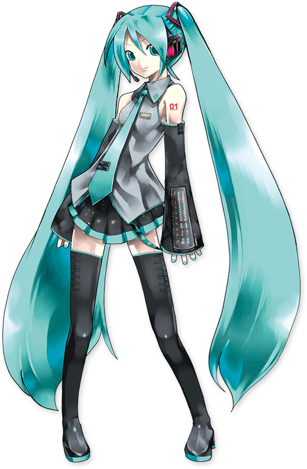

 

<pre>
    💻 CS Student · Computer Graphics · Rendering
    🎨 C / C++ · OpenGL · 3D Math · Algorithms
    📖 Learning AI · Digital Human · HCI · Embodied AI
    🎮 Anime · Games · Hatsune Miku
</pre>

 

<h3 align="center">🌱 These Days</h3>

`3D Math` → `Graphics` → `Rendering`

CPU Renderer · OpenGL · AtCoder

<h3 align="center">🛠️ Languages & Tools</h3>

<h3 align="center">📦 Projects</h3>

CPU Software Renderer · Real-time Rendering · Algorithm Practice

<h3 align="center">🚀 Future</h3>

`Rendering` → `Digital Human` → `Embodied AI`

Building intelligent beings that can see, speak and interact.

 

  

 

 

♪ World is colorful, one frame at a time.

  

Hatsune Miku artwork: Crypton Future Media, Inc. / Art by KEI.

