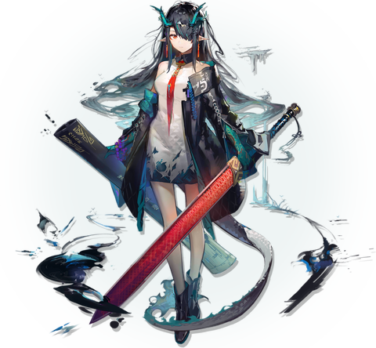
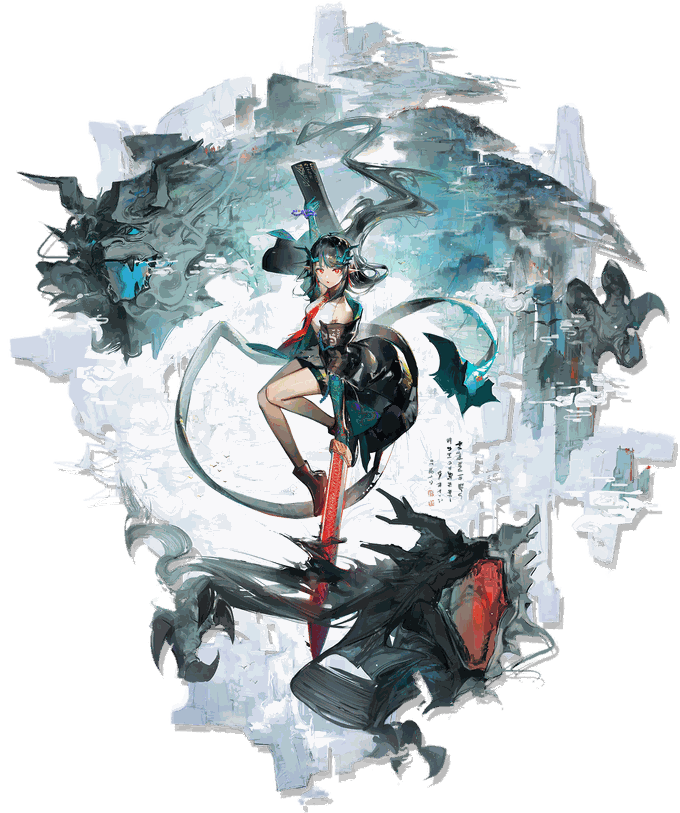

 

<h3>「 讲话太难懂了，我画出来给你看看。 」</h3>
— 夕 Dusk

 

<pre>
    🖌️  CS Student · Computer Graphics · Rendering
    ⚔️  C / C++ · OpenGL · 3D Math · Algorithms
    📖  Learning AI · Digital Human · HCI · Embodied AI
    🍵  Anime · Games · Arknights
</pre>

 

<h3 align="center">🖋️ 笔墨 · Tools</h3>

<h3 align="center">🏮 门 · Find Me</h3>

  

 

 

  
♪ 一画一世界，一帧一光阴。
  

  

  

Arknights © Hypergryph · Dusk artwork from the game

